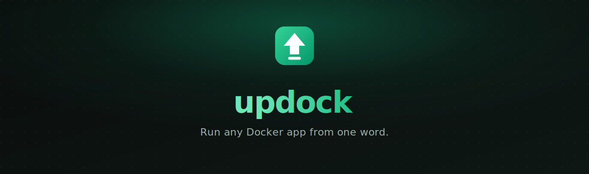

<div align="center">



<br><br>

[](https://github.com/amrelsagaei/updock/actions/workflows/ci.yml)
[](https://goreportcard.com/report/github.com/amrelsagaei/updock)
[](https://github.com/amrelsagaei/updock/releases)
[](LICENSE)
[](go.mod)

[Install](docs/installation.md) · [Quick start](docs/quickstart.md) · [Docs](https://amrelsagaei.github.io/updock/) · [Recipes](docs/recipes.md)

</div>

You type a name. updock finds the image, lets you pick a version, asks you the
few things that actually matter (ports, passwords, env vars), writes the Compose
file and `.env` for you, and brings it up. After that you control everything by
number.

```console
$ updock juice-shop

  Searching Docker Hub for "juice-shop"...

  1) bkimminich/juice-shop:latest        official-style, 50M+ pulls   [best match]
  2) bkimminich/juice-shop (choose version)
  3) bkimminich/juice-shop-ctf:latest    related

  Pick a number, or use arrows + enter: 1

  ✓ Created project 'juice-shop' (bkimminich/juice-shop:latest)
  Start it now? Yes
  ✓ juice-shop is running.
    http://localhost:3000
```

## Features

- **One word in, a running app out.** `updock postgres` searches Docker Hub,
  ranks the matches, and walks you to a running container.
- **Smart ranking.** Official and popular images surface first, with fuzzy name
  matching so the right image is almost always option one.
- **Version picker.** Choose a specific tag, sorted newest-first with proper
  semantic-version ordering and `latest` pinned on top.
- **No YAML, ever.** updock reads the image and asks only what matters: ports,
  required passwords, common env vars, volumes. Then it writes a clean
  `docker-compose.yml` and `.env` for you.
- **Strong secrets by default.** Required passwords are generated with
  `crypto/rand`, stored in a `0600` `.env`, masked in every view, and never
  written into the Compose file.
- **Control by number.** `updock ls` numbers everything; `updock up 2`,
  `updock logs 2`, `updock rm 2`. No names to retype.
- **Recipes for multi-service apps.** WordPress with MySQL, Nextcloud with
  MariaDB, Gitea with Postgres, and more, scaffolded and wired together. Add
  your own as plain YAML.
- **Live state.** `updock ls` queries Docker directly, so the state column is
  always real, never stale.
- **Not a lock-in.** Output is standard Compose. Keep the files and run
  `docker compose` yourself any time.
- **No telemetry.** updock never phones home.

## Get started in 30 seconds

```bash
# install (pick one; see the docs for every method)
brew install amrelsagaei/tap/updock
go install github.com/amrelsagaei/updock/cmd/updock@latest

# check your environment, then run something
updock doctor
updock postgres
```

Full walkthrough: [Quick start](docs/quickstart.md). Every install method:
[Installation](docs/installation.md).

## How it works

`updock <name>` runs a short pipeline: **preflight → search → select → inspect →
configure → scaffold → up**. It reads an image's ports and env vars from the
registry without pulling it, asks only the questions that matter, and starts the
stack in the background. The details are in [Usage](docs/usage.md).

## Documentation

The full documentation lives at [amrelsagaei.github.io/updock](https://amrelsagaei.github.io/updock/):

- [Installation](docs/installation.md) - every method, per OS, plus verifying a signed download
- [Quick start](docs/quickstart.md) - zero to running app
- [Usage](docs/usage.md) - the pipeline and control by number
- [Commands](docs/commands.md) - full command reference
- [Configuration](docs/configuration.md) - the config file and every option
- [Recipes](docs/recipes.md) - multi-service apps and authoring your own
- [Projects and file layout](docs/projects.md) - what updock writes and where
- [Security model](docs/security.md) - how secrets and images are handled
- [Troubleshooting](docs/troubleshooting.md) - common issues and fixes
- [FAQ](docs/faq.md) - short answers
